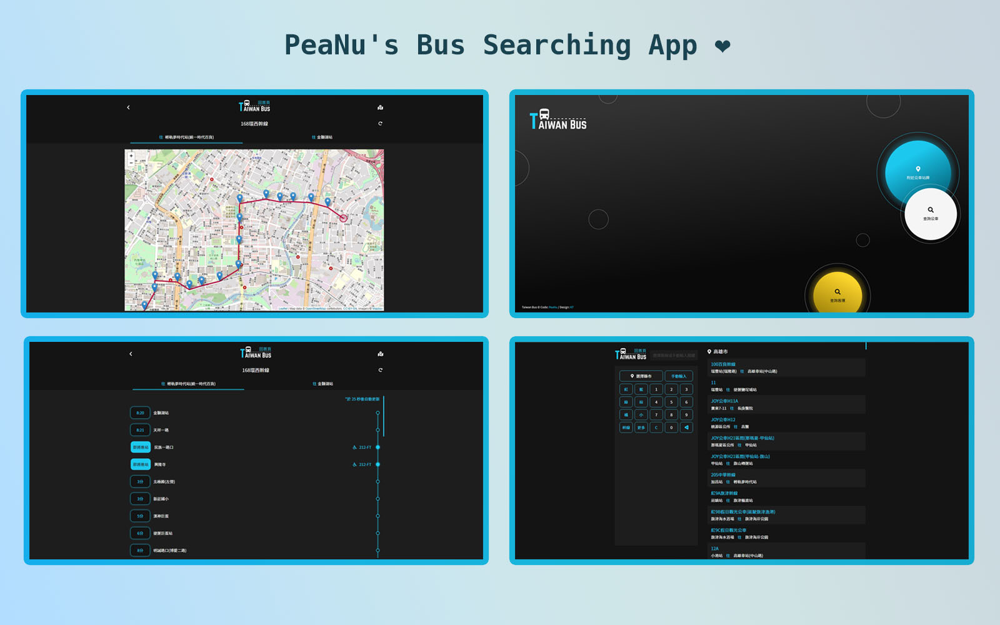
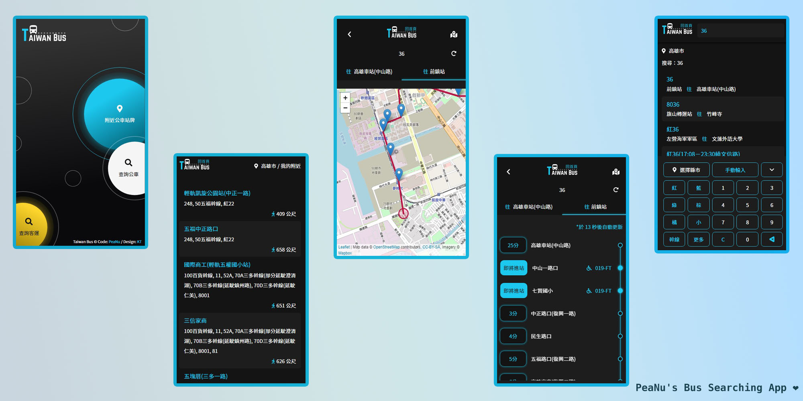

# The-F2E-3rd 修練精神時光屋第三屆－Week3 全台公車動態時刻查詢應用服務

這是來自[The-F2E-3rd](https://2021.thef2e.com/)的一個挑戰。The-F2E-3rd 是由[六角學院](https://www.hexschool.com/)主辦的一項競賽，主要是要提供給工程師、設計師一個可以練習專業技術的資源。目前 The-F2E 修練精神時光屋已經舉辦了三屆，有興趣的朋友也歡迎到連結中參考看看。

## 大綱

- [總覽](#總覽)
  - [公告消息](#公告消息)
  - [關於這份挑戰](#關於這份挑戰)
  - [螢幕截圖](#螢幕截圖)
  - [網站連結](#網站連結)
- [使用的工具](#使用的工具)
- [資料夾架構](#資料夾架構)
- [開發紀錄](#開發紀錄)
- [未來持續開發目標](#未來持續開發目標)
- [關於作者](#關於作者)
- [致謝](#致謝)
- [參考資料](#參考資料)

## 總覽

### 公告消息

#### 2021/11/29

為了確保各位有良好的使用體驗，這邊先做個置頂說明。

目前可以使用的功能：

- 查詢公車的路線
- 查詢公車的預估到站時間
- 查詢公車的地圖（路線圖）
- 查詢自己附近的公車站牌（預設範圍為 1 公里）
- 顯示附近站牌與自己的距離

目前不可以使用的功能：

- 客運相關的頁面、資料都尚未開始動工。
- 透過動態資料，查看公車是否為無障礙車種（這部分的資料還沒處理完善，所以目前顯示的並不是正確的結果）

### 關於這份挑戰

這份挑戰是要製作一個台灣公車/客運動態時刻及相關資訊的查詢網站，使用者應該要能夠：

- 在各種裝置上都能夠瀏覽該網站（手機、平板、電腦）
- 透過動態時刻表，來得知公車大約什麼時候到站
- 透過定位功能，來查看自己附近有哪些公車站牌
- 透過地圖功能，來更精準查看公車的行經路線及動態
- 透過搜索功能，來搜索想要了解的公車資訊

### 螢幕截圖

**🖥 桌機版：**

**📱 手機版：**

### 網站連結

- The-F2E 挑戰連結：[靜候佳音](#)
- Demo 網站連結：[這裡](https://jubeatt.github.io/The-F2E-3rd-Bus-Timetable/)

### 使用的工具

- [Vue.js (3.0)](https://v3.vuejs.org/guide/introduction.html)
- [Loading Overlay](https://www.npmjs.com/package/vue-loading-overlay)
- [TDX API](https://ptx.transportdata.tw/MOTC)
- [Geocoding API](https://developers.google.com/maps/documentation/geocoding/overview)
- [Distance Matrix API](https://developers.google.com/maps/documentation/distance-matrix/overview)
- [Leaflet](https://leafletjs.com/reference.html#tooltip)
- CSS Flex-box
- CSS Grid-box
- SCSS
- BEM
- ES6
- RWD
- AJAX

### 資料夾架構

- public 存放經過打包後的程式碼
  - favicon.jpg 可愛的 PeaNu 頭像
  - index.html 最後產生的 HTML 檔案
- src 儲存所有撰寫的原始碼
  - assets 只放我寫的 SCSS
    - components.scss 會重複使用的樣式元件
    - global.scss 基本全域樣式設定（文字、Hover 效果、背景色等）
    - mixin.scss 使用 `@mixin`撰寫的內容（目前只有 `media queries`）
    - reset.scss 讓瀏覽器統一並且重製的樣式（採用的是 [eric](https://meyerweb.com/eric/tools/css/reset/) 加上一點個人習慣的設定）
    - utilities.scss 單一功能性的樣式（文字色彩、大小、間距等等）
    - main.scss 每個頁面的樣式都寫在這隻檔案裡，裡面有加上註解來劃分每個頁面，不用怕找不到。
  - components 儲存 Vue 的單一元件檔案（基本上沒有用到，多半是我拿來測試或練習時所遺留的檔案而已）
  - lib 我自己寫的簡短函式庫
    - Authorization.js 用來設定發送 TDX API 時，需要帶上的相關 `header`
  - README-IMG 儲存 README 用到的圖片
  - router Vue 的路由相關設定
  - views 儲存所有頁面的 Vue 單一元件檔案
    - EstimatedTimeOfArrival.vue 預估到站頁面的內容（它是 `/SearchLocalBus` 下的子路由）
    - EstimatedTimeOfArrivalFromNearbyStation 預估到站頁面的內容（它是 `/SearchNearby` 下的子路由）
    - Home.vue 首頁的頁面
    - SearchGlobalBus.vue 查詢客運的頁面（目前還沒做完）
    - SearchLocalBus.vue 查詢公車的頁面
    - SearchNearby.vue 查詢附近站牌的頁面
    - SearchResult.vue 顯示查詢結果的頁面（它是 `/SearchLocalBus` 下的子路由）
    - Station.vue 某站牌所經過的所有公車的頁面（它是 `/SearchNearby` 下的子路由）
  - App.vue 用來包整個元件的根元件
  - main.js 整個程式的進入點

## 開發紀錄

純粹是紀錄自己每一天做了什麼，還有一些小筆記。有興趣的人可以看看～

### 2021/11/17

1. 完成首頁 UI（RWD）

### 2021/11/19

1. 完成查詢公車頁面 UI（RWD）

### 2021/11/20

1. 完成輸入面板的 UI（RWD）

### 2021/11/21

1. 完成公車路線 API 串接、過濾資料

### 2021/11/22

1. 重新規劃路由設定
2. 新增 Loading 效果
3. 部分 UI 新增、修正
4. 修正 RWD 顯示問題

### 2021/11/23

1. 再次重新規劃路由設定
2. SCSS 檔案優化（原本是一個頁面對應一支檔案、現在統一整合在 main.scss 中）
3. 完成公車動態頁面 UI（RWD）
4. 公車動態 API 資料串接（尚未完成）

### 2021/11/24

1. 處理進入公車動態頁面的 Bug
   - Bug 點：每次進入頁面時會顯示上一筆動態資料，而不是當前的動態資料
   - 解決方式：因為公車動態頁面是透過 `v-if` 來打開或隱藏畫面，而 `v-if` 會有節能機制的問題。為了確保每一次進入時都重新渲染，必須在該元件加上 `:key` 屬性來處理。（註：每一次 key 的值都必須不同）
2. 處理顯示公車狀態的 CSS（即將到站、進站中、預估時間等）
3. 完成公車動態 API 資料串接（去程、返程）
4. 公車動態部分修正（過長文字、優化動態判定，例如「尚未發車」或「顯示下一班時間」
5. 車種辨識問題無法解決。本來想用 `forEach` 發送查詢車種的請求，但會碰到「同步 / 非同步」之間的問題。目前是使用 `regexp` 來從資料字串中來辨識是否為無障礙車種。
6. 新增每 30 秒自動更新功能

### 2021/11/25

1. 公車動態 UI 介面優化（將內容更改為固定高度，超出的部分改用滾軸呈現）
2. 新增手動重新整理功能（有避免連續點擊）
3. 搜尋附近站牌 UI 完成
4. 搜尋附近站牌 API 串接（仍在處理）

### 2021/11/24

1. 處理進入公車動態頁面的 Bug
   - Bug 點：每次進入頁面時會顯示上一筆動態資料，而不是當前的動態資料
   - 解決方式：因為公車動態頁面是透過 `v-if` 來打開或隱藏畫面，而 `v-if` 會有節能機制的問題。為了確保每一次進入時都重新渲染，必須在該元件加上 `:key` 屬性來處理。（註：每一次 key 的值都必須不同）
2. 處理顯示公車狀態的 CSS（即將到站、進站中、預估時間等）
3. 完成公車動態頁面（去程、返程）
4. 公車動態部分修正（過長文字、優化動態判定，例如「尚未發車」或「顯示下一班時間」
5. 車種辨識問題無法解決。本來想用 `forEach` 發送查詢車種的請求，但會碰到「同步 / 非同步」之間的問題。目前是使用 `regexp` 來從資料字串中來辨識是否為無障礙車種。
6. 新增每 30 秒自動更新功能

### 2021/11/25

1. 公車動態 UI 介面優化（將內容更改為固定高度，超出的部分改用滾軸呈現）
2. 新增手動重新整理功能（有避免連續點擊）
3. 搜尋附近站牌 UI 完成
4. 搜尋附近站牌 API 串接（仍在處理）
5. 使用 `geolocation` 要注意一些安全性的問題（詳情參考[這裡](https://kknews.cc/zh-tw/tech/4qgkxq2.html)）

### 2021/11/26

1. 處理 `setInterval` 的 Bug
   - Bug 點：點擊自製的返回按鈕時，URL 會停留在原本的狀態（`/Search-LocalBus/EstimatedTimeOfArrival/:City/:RouteUID`）。正確的情況應該要顯示 `/SearchLocalBus`。
     這個問題會跟直接按下「上一頁」時發生衝突，導致倒數計數器沒辦法正確的清除。
   - 原本的思路：按下返回鈕時，清除計數器，向父層傳遞事件。
   - 新的思路：按下返回鈕時，透過 `router.push()` 導向 `/SearchLocalBus`，此舉會觸發路由鉤子中的 `beforeRouteLeave` 事件，接著在藉由該 handler 做以下處理：
     - `window.clearInterval(timerId)`清除計數器
     - 向父層傳遞事件（為了更新元件的隱藏與顯示）
     - 執行`next()`（進行跳轉）
2. 做個筆記：使用 `v-if` 的元件，都會在隱藏的時候被摧毀。不希望元件被摧毀的話，可以改用 `v-show`（原理是透過更改`display`值來顯示或隱藏）

### 2021/11/27

1. 完成定位功能、顯示附近站牌
2. 程式碼優化（使用 async / await 改寫，使程式碼更易讀）
3. 完成附近站牌的公車路線頁面及資料串接（有夠搞剛）
4. 避免掉產生重複資料的 Bug（已進行過濾）

### 2021/11/28

1. 完成附近站牌的 UI
2. 新增附近站牌與使用者所在位置的距離
3. 程式碼優化（為避免在取得距離時出錯，在請求失敗時會採用備用資料）
4. 程式碼修正（因為 Distance Matrix API 不開放跨來源請求，故目前改用兩點直線距離公式來取代）
5. 修復 favicon 未正確顯示的問題（public/index.html 中的 href 位址沒寫好）
6. 完成附近站牌的預估到站頁面
7. 使用者體驗優化（輸入面板調整。當按下紅、藍等路線時，不是直接添加到輸入框，而是整筆覆寫。）

### 2021/11/29

1. 完成地圖功能（顯示該公車的路線地圖）
2. 部分樣式微調整
3. README 撰寫

## 未來持續開發目標

1. 收藏功能。使用者可以把自己常用的車牌列入收藏，方便下次使用。
2. 計算距離功能優化。除了顯示與附近站牌距離之外，希望可以將附近站牌做「由近到遠」的排序顯示，讓使用者更一目了然。
3. 地圖功能優化。目前只能做出靜態站牌、介面也頗陽春。期望技術越來越好時，能搭配公車動態做同步顯示效果。
4. 個人化主題設定。使用者可以根據自己的喜好，切換至自己喜歡的主題色彩。
5. 提升穩定性。當請求失敗或資料發生錯誤時，可採取備用方案，而不是整個網站直接掛掉。
6. 將客運頁面資料完成，把還沒完成的坑給填完。

## 致謝

首先要謝謝的是六角學院，舉辦了這個有趣又刺激的競賽活動。雖然我只參與了第一週與第三週，但我學到的事情遠比我一開始預期中來得多。在經過了第一週的洗禮後，我變得更能活用 Vue，這個我一直很想學好的框架。

原本的我只會用 CDN 來玩一些基礎的操作（資料綁定、資料渲染、更新狀態等），到現在已經進階到能用 Vue-Cli 來建立一個正式的網站或 App。可以看到自己的成長，相信是比什麼都還讓人感到到開心的事。

雖然，這個過程中少不了各種有（痛）趣（苦）的事情：花了整整一個下午的時間，只為了除掉一隻 Bug、開發時用代理伺服器串 API 串的很開心，結果到生產環境時才發現這支 API 不開放跨網域請求、發現 API 的資料格式不是自己想要的，硬是用上各種迴圈加非同步請求來手工整理出自己想要的資料內容；還有天都已經亮了，而我還在這裡打心得感想 😂

另外，也要向同為參賽者的 UI 設計師[KT](https://www.behance.net/KT_Designer)說聲謝謝。我想每一個網站的背後都埋藏了許多前端工程師、後端工程師、UI 設計師及各種團隊成員的心血。雖然我知道自己還沒有把所有的功能都給做齊全，不過還是希望當妳看到這份作品，心中是感到滿意的。

最後想說，不論你是工程師、設計師，還是只是剛好路過的無名氏。希望你們品嘗這份作品時，能夠感到「哇，這個還不錯」、「這還蠻好用的」，這樣對我來說就是一份最大的鼓勵跟回報了 😊。當然，如果你有什麼想要建議的新功能，還是發現哪裡有什麼問題或 Bug，都很歡迎你透過[寄信](mailto:jimdevelopesite@gmail.com)、或其他聯繫方式來跟我泡茶聊天；還有，謝謝把這份 README 讀到最後的你 / 妳。

## 關於作者

- Website - [PeaNu's Paradise](https://jubeatt.github.io/)
- Facebook - [個人臉書](https://www.facebook.com/profile.php?id=100003593580513)

## 參考資料

- [The New CSS Reset](https://elad.medium.com/the-new-css-reset-53f41f13282e)
- [[Vue.js] 簡單登入頁面路由 part1](https://yuugou727.github.io/blog/2017/11/11/vue-login-practice/)
- [Leo Lin-Vue Router](https://linwei5316.medium.com/vue-router-4c2aad1cc352)
- [Vue.js - 使用 ESLint + Prettier 整理程式碼](https://ithelp.ithome.com.tw/articles/10231505)
- [input / button elements not shrinking in a flex container](https://stackoverflow.com/questions/42421361/input-button-elements-not-shrinking-in-a-flex-container)
- [在 JavaScript 中從字串中刪除最後一個字元](https://www.delftstack.com/zh-tw/howto/javascript/remove-last-character-from-javascript/)
- [colorhunt](https://colorhunt.co/palettes/popular)
- [Vue.js 操作或取得 DOM 的資訊-refs 用法](https://tools.wingzero.tw/article/sn/97)
- [Vue Loading Overlay Component](https://www.npmjs.com/package/vue-loading-overlay)
- [Using the Vue loading overlay plugin in your Vue apps](https://blog.logrocket.com/using-the-vue-loading-overlay-plugin-in-your-vue-apps/)
- [Router 基本入門 Day 9](https://ithelp.ithome.com.tw/articles/10223518)
- [emits 选项](https://v3.cn.vuejs.org/guide/migration/emits-option.html#_2-x-%E7%9A%84%E8%A1%8C%E4%B8%BA)
- [why component is not destroyed under v-if](https://stackoverflow.com/questions/53085722/why-component-is-not-destroyed-under-v-if/53085867)
- [遇到 async，別用 forEach](https://medium.com/@steven234/%E9%81%87%E5%88%B0-async-%E5%88%A5%E7%94%A8-foreach-7cea84f4242f)
- [使用 HTML5 地理位置定位到城市的方法及注意事項](https://kknews.cc/zh-tw/tech/4qgkxq2.html)
- [談談 JavaScript 的 setTimeout 與 setInterval](https://kuro.tw/posts/2019/02/23/%E8%AB%87%E8%AB%87-JavaScript-%E7%9A%84-setTimeout-%E8%88%87-setInterval/)
- [在 vue 中使用 setTimeout 與 setInterval](https://medium.com/%E5%86%8D%E4%B8%8D%E5%AF%AB%E5%B0%B1%E8%A6%81%E5%BF%98%E4%BA%86/%E5%9C%A8vue%E4%B8%AD%E4%BD%BF%E7%94%A8settimeout%E8%88%87setinterval-5b760e05ee2f)
- [經緯度查完整地理資訊 - Opencube - 開放資料平台](https://opencube.tw/location)
- [教學－如何使用 JavaScript Promise 簡化非同步流程](https://shubo.io/javascript-promise/)
- [Google Maps API 學習筆記 – 5：抓目前位置、計算到各點距離](https://www.letswrite.tw/google-map-api-distance-matrix/)
- [開發時的跨網域存取 - proxy-devServer](https://book.vue.tw/CH3/3-3-vue-dev-server-build.html#%E9%96%8B%E7%99%BC%E6%99%82%E7%9A%84%E8%B7%A8%E7%B6%B2%E5%9F%9F%E5%AD%98%E5%8F%96-proxy-devserver)
- [Vue Axios 開發環境、生產環境跨域問題解決](https://www.uj5u.com/qita/1309.html)
- [使用 javascript 計算兩個經緯度間的距離](https://tools.wingzero.tw/article/sn/72)
- [解決 Vue-cli 打包後，無法顯示 Favicon 的問題](https://smlpoints.com/notes-vue-cli-no-favicon-after-doing-webpack.html)
- [Leaflet tiles are not loading for multiple Bootstrap tabs](https://gis.stackexchange.com/questions/349295/leaflet-tiles-are-not-loading-for-multiple-bootstrap-tabs)
- [Vue.js 新手如何製作口罩地圖？一起來貢獻小小力量吧！](https://5xruby.tw/posts/how-to-create-maskmap-by-vuejs-and-osm)
- [Vue nextTick 處理完成後就換我!](https://ithelp.ithome.com.tw/articles/10240669)
- [06. Leaflet_Raster Layers](https://ithelp.ithome.com.tw/articles/10204277)
- [leafletjs](https://leafletjs.com/)
